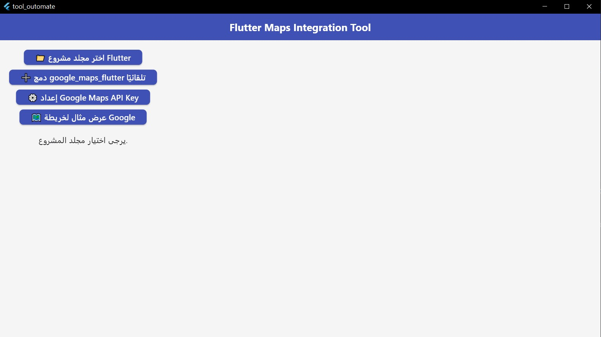
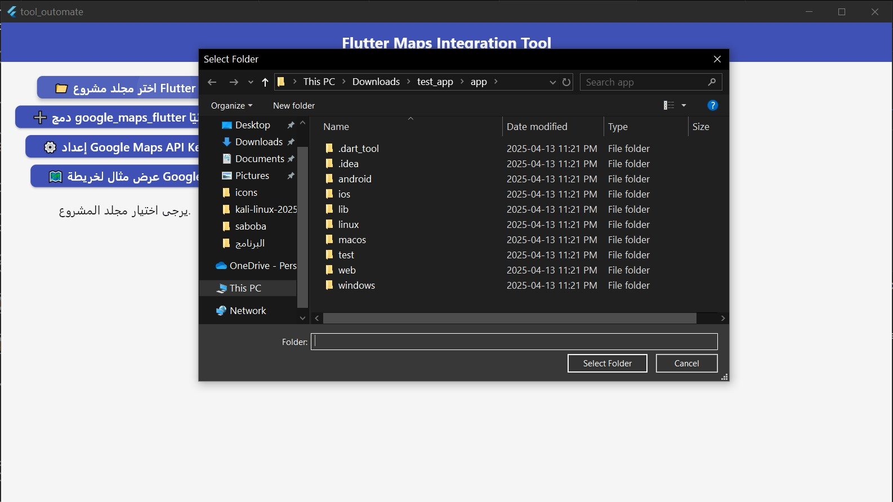
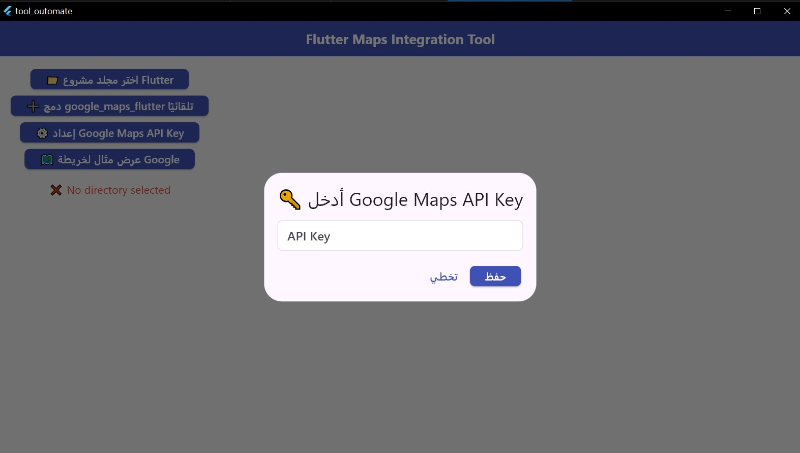

# 🗺️ Flutter Google Maps Integration Tool (with Bloc)

A Flutter desktop tool that **automates** the integration of `google_maps_flutter` into any existing Flutter project. Built as part of the [HeyFlutter.com](https://heyflutter.com) developer onboarding task.

---

## ✨ Features

✅ Select any Flutter project directory  
✅ Automatically add `google_maps_flutter` to `pubspec.yaml`  
✅ Run `flutter pub get` automatically  
✅ Prompt user to enter a **Google Maps API key**  
✅ Configure Android and iOS platform settings (AndroidManifest.xml & Info.plist)  
✅ Display a functional **Google Map** using **Bloc** with a marker on Cairo  

---

## 📸 Screenshots

 
 
 
 

---

## 📦 How to Run

```bash
git clone https://github.com/your-username/flutter_maps_integration_tool.git
cd flutter_maps_integration_tool
flutter pub get
flutter run -d windows  # or macos/linux depending on your OS
